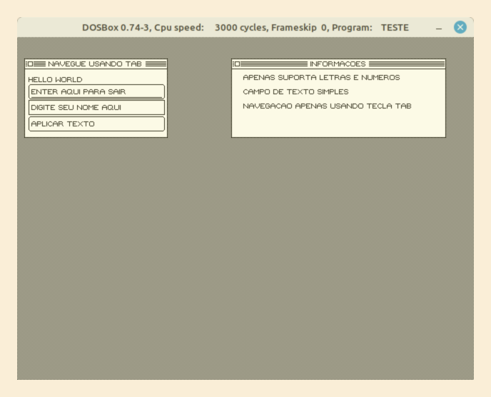

# Compilador HCBasic para 8086

**Para saber o estado atual veja as notas de versão da [v1.0 - Fix Pack 2](https://github.com/humbertocsjr/hcbasic/releases/tag/v1.0.2-fix-pack)**

Esta linguagem de programação tem como objetivo criar uma derivação de baixo nível da linguagem BASIC moderna direcionada para maquinas 16 Bits, inspirada no VisualBasic.NET, QuickBASIC. Inicialmente está sendo implementado apenas o gerador de código para 8086, mas o compilador é flexível podendo facilmente adicionar novos processadores.

Esta linguagem não tem como objetivo ser orientada a objetos, sendo próximo de uma versão 16Bits procedural do VisualBasic.NET, onde os comandos são agrupados em módulos, com uma dinâmica de nomes próxima as bibliotecas do .NET Framework.

Este compilador foi criado 100% em linguagem C#, evitando ferramentas de geração automática de compiladores como BISON ou Yacc, o que deixam o código "misterioso" para programadores não versados em estruturas como BNF ou EBNF, feito com o código completamente em português, pois todos os exemplos de compilador que conheço são em inglês sendo uma grande barreira para aprendizado na prática para não falantes desta lingua.

Acompanhe também o projeto irmão deste, um sistema operacional para IBM PC, feito com esta linguagem de programação, e de onde virá a base de todas as bibliotecas dessa linguagem. [HUSIX](https://github.com/humbertocsjr/husix)

**Implementado ElseIf a partida da [v1.0 - Fix Pack ](https://github.com/humbertocsjr/hcbasic/releases/tag/v1.0.2-fix-pack)**

**Exemplo 'gui.hcb' incluso a partir do [v1.0 - Fix Pack 2](https://github.com/humbertocsjr/hcbasic/releases/tag/v1.0.2-fix-pack)**



## Novidades

- Acelerado algoritmo do System.Forms para focus e lostfocus, aumento de desempenho calculado em 200% durante ControlPaint
- Implementado forma de exportar um módulo usando marcador Public antes do Module
- Implementado forma de importar um módulo usando formato Module NOME From "arquivo" (Não implementado para DOS ainda)
- Implementado 
- Implementado ElseIf
- Agora UInt8 e Int8 podem usar os comandos ROL, ROR, SHL, SHR
- O Compilador verfica se uma variável local esta sendo lida antes da sua inicialização
- Forma de implementar um Interrupt Handler usando comando Sub NOME() Handles Interrupt
- Proteção mínima contra estouro de pilha (Apenas verifica quando entra numa rotina)
- Implementado Try Catch, Throw e o Comando Error para definir o código do erro
- Implementada Função ErrorFile() para pegar o nome do arquivo e ErrorLine() para pegar o numero da linha onde ocorreu o erro
- Capturado divisão por zero e enviado para o Try Catch como Código 1 = DivByZeroError
- Implementado estruturas estaticas que não precisam do comando New, estas declaradas no módulo
- Corrigido GoTo que retornava um erro ao compilar
- Implementado String.Copy e String.Concat na biblioteca para copiar uma string e concatenar
- **Resolvidos vários bugs de ponteiro**
- Implementação da atribuição sem o comando Let
- Criada um mecanismo de gerar as distribuições, será usado a partir do momento compilador e a Biblioteca System estiver utilizável para subir os Releases no GitHub
- Implementado Estruturas (Falta suporte a ponteiros para rotinas)
- Implementado a Biblioteca System, com os recursos de Console e Arquivos basico
- Agora existem Ponteiros para Função e Rotinas e suas chamadas (Baseado no Func(Of), Action(Of) e .Invoke() do VB.Net)

## Requisitos Mínimos para Utilização

Todas as versões de distribuição vem embutidas os arquivos necessários para funcionamento não precisando instalar o .NET 7.0

Na distribuição vem um exemplo chamado helloworld.hcb que pode ser compilado pelo script compilar.sh ou compilar.bat dependendo da plataforma.

- Sistema Operacional:
    - macOS Sierra ou Superior - Intel
    - macOS Big Sur ou Superior - Apple M1
    - Windows 7 SP1 ESU ou Superior
    - Linux (Intel 64 bits/Intel 64 bits usando MUSL/ARM 32 bits/ARM 64 bits)
- NASM para montagem do código assembly gerado

## Requisitos Mínimos para Desenvolvimento

- DotNET SDK 7.0 para Windows, Linux ou macOS
- DOSBox para testes dos arquivos gerados
- NASM para montagem do código assembly gerado
- Recomendado uso de um editor próprio como Visual Code/Visual Studio/JetBeans Rider

O uso do Makefile é opcional e voltado para Linux e macOS, existindo apenas para facilitar e gerar as distribuições

## Bugs/Problemas conhecidos

- Try Catch tráz uma limitação de uso exclusivo em monotarefa, pois armazena seus ponteiros estaticamente, deverá ser alterado para armazenar 100% em pilha permitindo uso em multitarefa

## Objetivos Atuais e Prioritários

- Limpeza de itens não utilizados na implementação do Saida

## Objetivos para Versão 1.0

- [ ] Melhorar a System.hcb 

## Objetivos para Versão 1.1

- [ ] Implementar System.Drawing de forma completa
- [ ] Concluir a criação da fonte e suporte a acentos
- [ ] Implementar Protótipo da System.Forms
- [ ] Importar Gerenciador de Memoria do HUSIX Kernel para que possa alocar dinamicamente memoria
- [ ] Incluir suporte a executáveis HUSIX

## Objetivos para Versão 1.2

- [ ] Importar as bibliotecas do Framework do HUSIX e adaptar para o DOS, como System.Threading, System.Threading.Semaphore, System.Text.UTF8, System.Timer, System.IO, System.IO.Console, etc
- [ ] Implementar modos gráficos coloridos para System.Drawing

## Objetivos para Versão 2.0

- [ ] Migrar mecanismo do HUSIX que permite carregar bibliotecas externas ao executavel e liga-las dinamicamente, quebrando o limite de 64 KiB mesmo em executaveis .COM

## Objetivos

- [x] Suporte a módulos
- [x] Suporte a variáveis globais(do módulo) e locais
- [x] Suporte a sub-rotinas e funções
- [x] Comandos IF e WHILE
- [x] Suporte a números 8 e 16 bits
- [x] Implementar chamada de funções dentro de expressões/atribuições
- [x] Implementar na biblioteca System, comandos de manipular arquivos
- [x] Correto tratamento e diferenciação do public e private
- [x] Comando FOR
- [x] Suporte a rotinas externas usando ponteiro (Implementar comando INVOKE)
- [x] Implementar tipos personalizados usando uma dinâmica próxima ao TYPE do QuickBASIC, por trás usar comandos do PtrByteArray e PtrWordArray, mas permitindo declarar Rotinas, para ser uma proto orientação a objetos para poder implementar as bibliotecas System de forma mais próxima ao .NET
- [x] Ponteiros
- [x] String (Concatenar, Copiar, etc)
- [ ] String avançado (Substring, UTF-8)
- [ ] Diminuir código gerado pelo Try Catch, otimizando multiplos comandos genéricos em comandos especializados para o Saida
- [x] Adicionar ao inicio das constantes de texto, o seu tamanho para evitar o estouro de variável pelas rotinas de manipulação de Strings
- [x] Suporte a números 32 bits na biblioteca
- [ ] Suporte a números 32 bits na linguagem
- [x] Inclui apenas módulos usados no projeto, deixando o executável mais compacto
- [x] Permitir conversão dos ponteiros PtrByteArray em PtrWordArray de forma simples
- [x] Implementar um tipo de Try Catch Finally / Throw Exception
- [x] Implementar no Try Catch forma de descobrir o nome do arquivo e linha onde ocorreu o erro
- [ ] Armazenar ponteiros do Try Catch totalmente em pilha, evitando problemas em multitarefa
- [x] Implementar SizeOf para tipos e para variaveis
- [x] Implementar forma de definir os diretórios de pesquisa do Imports
- [ ] Quanto tudo estiver pronto, criar um protótipo do compilador feito diretamente em HCBasic para que seja executável localmente, para isso usar assemblers já existente para a plataforma, por exemplo o Old-School Assembler para DOS

## Exemplo de código

Todo programa deve ter um Módulo chamado Program com uma rotina chamada Main para ser executável.

```vb

Imports System

Module Program

    Public Sub Main (args as ptrbytearray)
        Dim texto as String
        Dim texto2 as String
        texto = new
        texto2 = new

        Console.WriteLine "Hello World!!"
        Console.ReadLine texto
        String.Copy texto2, "O usuário digitou: "
        String.Concat texto2, texto
        Console.WriteLine texto2

    End

End

```

## Gerando Distribuição (no Linux ou macOS)

Para gerar os arquivos de distribuição para várias plataformas basta executar o comando abaixo:

```sh
make distro
```

Serão atualizados os arquivos na pasta Distro, onde cada subpasta pertence a uma plataforma suportada

## Compilando e instalando no Linux ou macOS

```sh
make

sudo make install
```

## Compilando no Windows

No PowerShell execute

```powershell
dotnet publish -c Release -o Distro\Atual
```

Os executaveis devem se encontrar em Distro/Atual

## Uso

O Compilador HCBasic gera arquivos em Assembly, para executar a compilação basta chamar o compilador com o nome do arquivo basic, o arquivo assembly destino, e a lista de diretorios onde irá buscar as bibliotecas de modulos.

```sh

hcbasic teste.hcb teste.asm Plataformas/8086-DOS Plataformas/8086

nasm -f bin -o teste.com teste.asm

```

# Linguagem HCBasic

*Este texto será expandido conforme a evolução do projeto*

Esta linguagem de programação tem fortes inspirações no VisualBasic.NET e na plataforma .NET Framework, porém sem recursos de orientação a objetos, por se tratar de uma linguagem procedural, com acessos de baixo nível, onde se encaixa próximo a linguagens como o C e Pascal clássico.

Por ser uma linguagem da família BASIC, ela herda algumas de suas características, como a indistinção entre maiúsculas e minúsculas para comandos e nomes de variáveis, onde por exemplo: teste, TESTE e TEste são tratados como o mesmo item.

E para simplificar e modernizar a linguagem foi padronizado o fechamento de blocos com apenas 'end', onde nas linguagens antigas eram utilizados por exemplo: 'end sub', 'end function', 'next', 'wend', ficando parecido com fechamento de linguagens como Ruby.

**Com isso, este código é válido:**

```vb
If i < 10 Then
End
```

**Porém este é inválido**

```vb
If i < 10 Then
End If
```

## Módulos

Para melhor organização, o código fonte é dividido em módulos, onde cada módulo pode ter seus campos e rotinas.

Cada arquivo de código fonte pode ter um ou mais módulos, não havendo limite de número de módulos, e estes são compilados conforme uso, por exemplo para que um módulo entre no executável ele tem que ser referenciado diretamente ou indiretamente pelo módulo Program, assim economizando espaço no executável que seria ocupado por módulos que no momento não são usados no projeto.

Para declarar um módulo basta usar o comando Module conforme abaixo:

```vb
Module Program
End
```

Lembrando que todo programa deve ter ao menos um Módulo Program com uma rotina pública chamada Main dentro.

## Rotinas (Sub e Function)

Os códigos dentro dos Módulos são separados em Rotinas, que podem ser chamadas umas pelas outras, para simplificar o código.

As rotinas podem ser separadas em dois tipos:

* Function - Permite retorno de valores para o chamador
* Sub - Não permite retorno de valores para o chamador

As rotinas podem ser marcadas como acessível publicamente ou privadamente, onde apenas as rotinas públicas são acessíveis de fora do módulo atual.

Para chamar uma rotina deve-se informar seu nome seguido dos argumentos, porém quando dentro de uma expressão que espera seu retorno, deve-se informar os argumentos entre parenteses conforme exemplo abaixo:

```vb
variavel = Rotina() 'Exemplo sem argumentos
variavel = RotinaComArgs(1, 2) ' Exemplo com argumentos
Rotina 'Exemplo sem argumentos
RotinaComArgs 1, 2 ' Exemplo com argumentos
```

**Exemplo de declaração de rotinas:**

```vb
Module Program
    Public Sub Main (args as ptrbytearray)
        ' Esta rotina pode ser chamada de fora do Módulo
        Dim teste as UInt16
        teste = Retorna2() ' Chama uma rotina e guarda seu retorno em teste
        RotinaInternaDoModulo ' Chama uma rotina sem retorno de valor
    End

    Public Function Retorna2 as UInt16
        ' Esta rotina é pública e pode ser chamada de dentro ou de fora deste módulo
        return 2 ' Retorna o número 2 para o chamador
    End

    Private Sub RotinaInternaDoModulo
        ' Esta rotina é invisível para outros módulos podendo apenas ser chamada por este módulo
    End
End

```

## Ponteiros para rotinas

Para chamar indiretamente uma rotina, de forma dinâmica, deve-se declarar um tipo com argumentos esperados, e após chamar usando o sub-comando invoke.

Para associar um ponteiro a uma função deve-se usar a função AddressOf que tem como seu único argumento o nome da rotina destino.

**Exemplo:**

```vb
    Dim funcaoSoma as Func(Of UInt16, UInt16, UInt16)
    ' Os primeiros itens do comando Func informam os tipos de argumentos, sendo o último informando o retorno
    funcaoSoma = AddressOf(Soma) ' Associa o funcaoSoma a rotina Soma
    Console.WriteUInt16 funcaoSoma.Invoke(1, 2) ' Invoca a rotina que o funcaoSoma aponta

    Dim funcaoEscreva as Action(Of String)
    ' Todos os arguentos do Action, são argumentos da rotina destino
    funcaoEscreva = AddressOf(Escreva)
    funcaoEscreva.Invoke "Teste" ' Invoca a rotina que o funcaoEscreva aponta


    ' EXEMPLO DAS ROTINAS REFERENCIADAS ACIMA

    Public Function Soma(valor1 as UInt16, valor2 as UInt16) as UInt16
        Return valor1 + valor2
    End

    Public Sub Escreve(texto as String)
        Console.WriteLine texto
    End

```


## Importar Bibliotecas/Arquivos Externos

Para facilitar e simplificar o desenvolvimento separando os módulos em arquivos para agilizar a sua localização, a linguagem aceita unir vários arquivos e referência-los usando o comando 'Imports'.

Este comando recebe como parâmetro o nome do arquivo sem sua Extensão, este nome deve ser único, e colocado na pasta do projeto ou na pasta de bibliotecas do compilador.

**Exemplo:**

Nome do arquivo: System.hcb

Comando para inclusão:

```vb
Imports System
```

Nome do arquivo: System.Text.hcb

Comando para inclusão:

```vb
Imports System.Text
```

Preferencialmente devem ser colocados no topo do arquivo para melhor legibilidade.

Deve-se sempre importar o arquivo **System** ao projeto pois ele contém a biblioteca e recursos base para uso da linguagem.

Recomendase uso de um editor de texto com suporte a colorização, sendo este o caso selecione o modo de colorização "Visual Basic" ou "Visual Basic.NET" para melhor visualização

## Variáveis Locais e Campos do Módulo

Por ser uma linguagem próxima ao baixo nível, os tipos de variáveis se limitam ao que o processador suporta, e por este compilador ter como objetivo plataformas 16 bits, se limita os tipos base a 16bits, podendo manipular números tanto com ou sem sinal, mudando o range conforme o capítulo **Tipos de dados** deste manual.

### Declaração de variáveis e campos

Para declarar uma variável deve-se usar o comando Dim, informando o nome da variável seguido de seu tipo conforme abaixo:

```vb
Dim NomeDaVariavel as UInt16
```

Os campos usam o mesmo comando mas podem ter os marcadores de público e privado adicionados, sendo na ausência desse sempre considerado privado.

```vb
Public Dim NomeDoCampoPublico as UInt16
Private Dim NomeDoCampoPrivado as UInt16
Dim NomeDoCampoPrivadoAlternativo as UInt16
```

### Números e Formatos

Inicialmente aceita os formatos de número abaixo:

| Formato | Descrição | Exemplo |
|---------|-----------|---------|
| 00000 | Número decimal de 16 bits | 12345 |
| 0x0000 | Número hexadecimal de 16 bits | 0x1234 |

### Tipos de dados

As variáveis e campos usam tipos rigidamente especificados, não havendo tipos genéricos. Abaixo segue a lista de tipos aceitos:

| Tipo | Descrição| Alcance |
|------|----------|---------|
| UInt8 | Inteiro sem sinal de 8 bits | 0...255 |
| Int8 | Inteiro com sinal de 8 bits | -128...127 |
| UInt16 | Inteiro sem sinal de 16 bits | 0...65535 |
| Int16 | Inteiro com sinal de 16 bits | -32768...32767 |
| PtrByteArray | Ponteiro para Array de UInt8 | 0...255 |
| PtrWordArray | Ponteiro Array de UInt16 | 0...65535 |
| String | Esta é uma estrutura da especial da Biblioteca gerenciada pelo Compilador de forma especial | 128 bytes de texto se inicializado com New |

* Os tipos PtrByteArray e PtrWordArray tem uma propriedade especial de definir seu destino/origem de dados usando caracteres especiais como '@' para definir o desvio(Offset) e '#' para definir o segmento(Seg) da memória, para acesso a qualquer ponto da memória RAM mesmo em arquiteturas que não permitem acesso facilitado a trechos externos ao aplicativo.
* O Tipo PtrByteArray pode receber um texto como valor diretamente, alterando o ponteiro para o texto informado, não precisando alterar o Segmento e Desvio do ponteiro manualmente.
* Ao incrementar o desvio do PtrWordArray, está movendo o ponteiro apenas um byte, pois a resolução de posicionamento dos ponteiros são em bytes.

## Manipulação de variáveis e campos

**Exemplo de uso:**

```vb
Imports System

Module Program
    Public Sub Main (args as ptrbytearray)
        ' Declara as variáveis
        Dim varUI8 as UInt8
        Dim varUI16 as UInt16
        Dim ptrTexto as PtrByteArray
        Dim ptrVideo as PtrByteArray
        ' Define os valores das variáveis
        varUI8 = 1+35
        varUI16 = varUI8 + 55
        ' Define um ponteiro para uma string
        ptrTexto = "Teste"
        ' Define um ponteiro manualmente
        '   Formato usada para HEXADECIMAL 0x0000
        '   Define o segmento
        #ptrVideo = 0xB800 
        '   Define o desvio
        @ptrVideo = 0
        ' Altera o conteudo do ponteiro
        ' Escreve um A (65 em UInt8) na tela
        ptrVideo = 65
        ' Pula para a próxima posicao da memoria de video (+2)
        @ptrVideo ++
        @ptrVideo ++
        ' Escreve um B (66) na tela ao lado do A
        ptrVideo = 66
        ' Escreve o conteúdo da variável ptrTexto
        Console.Write ptrTexto
    End
End
```

## Lógica e matemática

Com excessão do AND, OR e XOR, as demais comparações lógicas retornam valores fixos para sim e não, porém os comandos que utilizam expressões lógicas aceitam quaisquer valor diferente de 0(Zero) como Verdadeiro/Sim e o 0(Zero) como Falso/Não.

**Retornos das comparações lógicas**
| Comparação | Descrição | Retorno |
|------------|-----------|---------|
| And | Aplica E entre os bits dos parametros | Retorna o valor usando a lógica AND do processador |
| Or  | Aplica Ou entre os bits dos parametros| Retorna o valor usando a lógica OR do processador |
| Xor | Aplica Ou Exclusivo entre os bits dos parametros | Retorna o valor usando a lógica XOR do processador |
| AndAlso | Caso o primeiro parâmetro seja falso, não avalia o segundo, retornando falso diretamente | Retorna 0xffff para Verdadeiro e 0 para Falso |
| OrElse  | Caso o primerio parâmetro seja verdadeiro não avalia o segundo retornando verdadeiro diretamente | Retorna 0xffff para Verdadeiro e 0 para Falso |
| < | Menor que | Retorna 0xffff para Verdadeiro e 0 para Falso |
| <= | Menor ou igual | Retorna 0xffff para Verdadeiro e 0 para Falso |
| > | Maior que | Retorna 0xffff para Verdadeiro e 0 para Falso |
| >= | Maior ou igual | Retorna 0xffff para Verdadeiro e 0 para Falso |
| == | Igual | Retorna 0xffff para Verdadeiro e 0 para Falso |
| <> | Diferente | Retorna 0xffff para Verdadeiro e 0 para Falso |

**Operações matemáticas/lógicas não comparativas**

| Operação | Descrição |
|----------|-----------|
| ++ | Incrementa um valor |
| -- | Decrementa um valor |
| + | Soma dois valores |
| - | Subtrai dois valores |
| * | Multiplica dois valores |
| / | Divide dois valores |
| Mod | Divide dois valores, retornando o resto da divisão |
| Shl | Move os bits do primeiro valor a esqueda pela quantidade no segundo valor, adicionando zero na lacuna, usando normalmente para multiplicações binárias |
| Shr | Move os bits do primeiro valor a direita pela quantidade no segundo valor, adicionando zero na lacuna, usando normalmente para divisões binárias |
| Rol | Rotaciona os bits do primeiro valor a esquerda pela quantidade no segundo valor |
| Ror | Rotaciona os bits do primeiro valor a direita pela quantidade no segundo valor |

**Dúvidas comuns:**

Qual a diferença do Shl com o Rol e do Shr com o Ror?

    Quando se aplica o SHL ele descarta o bit mais a esquerda e adiciona um 0 no bit mais a direita enquanto move os demais, enquando no ROL ele pega o bit mais a esquerda e posiciona no lugar no bit mais a direita enquanto move os demais, no caso dos SHR e ROR, usam a mesma lógica porém para o outro sentido.

    Exemplo usando Inteiro sem sinal de 8 bits (0-255):

    Formula: 128 SHL 1 => 0
    Em binarios: 10000000 SHL 1 => 00000000 (1 é descartado)

    Enquanto

    Formula: 128 ROL 1 => 1
    Em binarios: 10000000 ROL 1 => 00000001 (1 é movido)

    Outro exemplo:

    Formula: 131 SHL 1 => 6
    Em binarios: 10000011 SHL 1 => 00000110 (1 é descartado)

    Enquanto

    Formula: 131 ROL 1 => 7
    Em binarios: 10000011 ROL 1 => 00000111 (1 é movido)


## Estruturas de Dados

Para facilitar a manipulação de estruturas complexas de dados é possível usar o tipo Structure para manipulação de objetos planos de dados.

Pelas estruturas ocuparem um espaço maior na memória local, a alocação é manual, usando uma atribuição que recebe o comando "New" OU recebendo o segmento e desvio como outros ponteiros.

Apenas podem ser inicializadas estruturas com o comando "New" se elas se restringirem a rotina atual e as rotinas que esta chamar, então com isto, na implementação atual, não se pode retornar uma Structure para a função chamadora, pois a alocação da memória é temporária e existe apenas dentro da execução da rotina atual.

**IMPORTANTE:** O compilador não verifica se o ponteiro da Structure foi inicializado usando New ou usando a definição de segmento e desvio como os demais ponteiros, portanto o valor inicial dele é inválido e sua manipulação pode gerar corrupção de dados, isto deve ser alterado no futuro, mas por enquanto lembre-se de **SEMPRE** inicializar suas variáveis

Sobre os ponteiros de rotina dentro de estrutura, caso a função/sub-rotina atrelada tenha como primeiro argumento a propria estrutura, esta será passada automaticamente.

**Exemplo:**

```vb

Imports System

Structure EstruturaTeste
    Dim Campo0 as UInt16
    Dim Campo1 as UInt16
    Dim Soma as Func(Of EstruturaTeste, UInt16)
End

Module Program
    Public Sub Main(args as PtrByteArray)
        Dim teste as EstruturaTeste
        teste = New
        ' Pode chamar rotinas usando a estrutura
        IniciaTeste teste
        ' Manipulação dos valores
        teste.Campo0 = 1
        teste.Campo1 = teste.Campo0 + 1
        ' Caso o primeiro argumento seja o proprio tipo ele é passado automaticamente pelo compilador
        Console.WriteUInt16 teste.Soma()
    End

    Public Sub IniciaTeste(teste as EstruturaTeste)
        ' Porem as rotinas apenas podem manipular a estrutura
        ' Nao podendo criar uma nova e retornar para a rotina anterior
        teste.Campo0 = 1
        teste.Campo1 = 2
        teste.Soma = AddressOf(SomaEstruturaTeste)
    End

    Public Function SomaEstruturaTeste(teste as EstruturaTeste) as UInt16
        Return teste.Campo0 + teste.Campo1
    End

End


```

## Erros e Interceptação de Erros

Para impedir que falhas invisíveis se acumulem e gerem falhas graves, há formas de interceptar e gerar notificações de erros, usando comandos simples.

*O que é um erro?*

- Um erro é uma derivação não desejavel do fluxo, por exemplo quando se utiliza duas variáveis para fazer uma divisão, mas o dividendo contém 0, portanto impossibilitando a divisão.

**Para evitar que haja quebras indesejáveis no fluxo do programa, pode se usar o comando Try para interceptar falhas previsíveis e imprevisíveis**

```vb

Try
    ' Execute aqui o código que pode apresentar erros, por exemplo abertura de arquivos, que podem retornar um acesso negado
Catch Error
    ' Intercepta o erro executando comandos que previnem falhas maiores na execução do código
End

```

O comando Try é composto por duas partes, a parte monitorada, e a parte de contenção e tratamento de erros, esta segunda parte utiliza o comando Catch para informar qual erro ela trata, podendo ter mais de um Catch prevendo vários cenários, ou mesmo um cenário genérico.

**Comando: Catch [Tipo de Erro]**

Ao declarar o tipo de erro, apenas aquele tipo é interceptado pelo Catch, caso não se enquadre verifica o Catch abaixo, caso nenhum Catch se enquadre a execução do programa é cancelada emitindo o erro ao sistema operacional.

```vb

Try

    ' Código que pode gerar multiplos erros

Catch DivByZeroError
    ' Executa apenas quando houver um erro de divisão por Zero
Catch StackOverflowError
    ' Executa apenas quando houver um erro de estouro da pilha
Catch Error
    ' Executa para quaisquer erros não declarados acima, e na ausência deste, quando houver um erro que não se enquadre é cancelada a execução do programa e retorna ao sistema operacional
End

```

Agora que se sabe qual é o erro dentro do Catch, pode-se extrair qual o arquivo e linha de código onde o erro foi detectado, usando duas funções embutidas chamadas ErrorFile() e ErrorLine().

- ErrorFile() = Retorna um ponteiro para uma string que informa o nome do arquivo onde ocorreu o erro
- ErrorLine() = Retorna o número da linha de código onde ocorreu o erro, facilitando a correção posterior pelo programador


```vb

Try

    ' Código que pode gerar multiplos erros

Catch Error
    Console.Write "Ocorreu um erro na linha "
    Console.WriteUInt16 ErrorLine()
    Console.Write " no arquivo '"
    Console.Write ErrorFile()
    Console.WriteLine "'."
End

```

Tipos de erro padrão e seus códigos, não se deve utilizar para uso próprio códigos de erro inferiores a 1000, para que não hajam conflitos com códigos oficiais de erro da linguagem existente ou futuros.


 - Error = 0
 - DivByZeroError = 1
 - StackOverflowError = 2
 - OutOfMemoryError = 3
 - OutOfBoundsError = 4
 - NotFoundError = 5
 - AlreadyExistsError = 6
 - NotImplementedError = 7
 - UnknownError = 8
 - CapacityOverflowError = 9
 - NoAnswerError = 10
 - TimeoutError = 11
 - InvalidValueError = 12
 - AccessDeniedError = 13


Para controladamente gerar um erro, deve-se usar o comando Throw [Tipo de Erro], conforme exemplo abaixo

```vb

Try

    ' Emite um erro do tipo NoAnswerError
    Throw NoAnswerError

Catch NoAnswerError
    Console.Write "Ocorreu um erro na linha "
    Console.WriteUInt16 ErrorLine()
    Console.Write " no arquivo '"
    Console.Write ErrorFile()
    Console.WriteLine "'."
End

```

Para se declarar um novo tipo de erro, deve-se colocar na raiz do arquivo de código fonte, preferencialmente acima dos módulos usados, o comando error [Tipo de Erro] = [Código do erro]

```vb

' Exemplo de declaração
error CustomError = 1000


Module Program
    Public Sub Main(args as String)
        Try
            ' Exemplo de uso
            Throw CustomError
        Catch CustomError
            ' Exemplo de interceptação
        End
    End

```

## Comandos da linguagem

Lembrando que a linguagem HCBasic não diferencia maiúsculas com minúsculas, os comandos estão escritos com a primeira letra maiúscula apenas por questão estética.

### Função SizeOf

Esta função retorna o tamanho em bytes de um determinado item, podendo ser o nome de uma estrutura, uma variável ou um tipo de dado.

```vb

Dim teste as String

Console.Write "Tamanho de um ponteiro para uma estrutura do tipo String: "
Console.WriteUInt16 SizeOf(teste)
Console.WriteLine ""

Console.Write "Tamanho de uma estrutura chamada Usuario: "
Console.WriteUInt16 SizeOf(Usuario)
Console.WriteLine ""

Console.Write "Tamanho de item do tipo UInt16: "
Console.WriteUInt16 SizeOf(UInt16)
Console.WriteLine ""

Console.Write "Tamanho de um campo dentro de uma estrutura: "
Console.WriteUInt16 SizeOf(teste.Capacity)
Console.WriteLine ""

```

### If Then Else

O If executa seu conteúdo conforme o resultado de uma comparação.

```vb
If A > 0 Then
    ' Executa apenas se o conteúdo de A for maior que 0
Else
    ' Executa apenas se o conteúdo de A for menor ou igual a 0
    ' Lembrando que o ELSE é opcional, podendo não ser colocado, ai o código apenas ignorará o IF caso a comparação seja falsa
End

' Variação de uma linha
If A > 0 Then Return 0 Else Return 1
```

### While

Repete seu conteúdo enquanto o resultado de uma comparação for verdadeiro.

```vb
While A < 10
    ' Executa apenas se o valor inicial de A for menor que 10, e continua executando enquanto A for menor que 10

    ' Adiciona 1 ao A, sem este comando ou alguma alteração em A, esta repetição seria infinita
    A ++
End

' Variação de uma linha
While A < 10 Let A ++
```

### For

Repete seu conteudo o numero de vezes definido pelo intervalo declarado, incrementando o valor da variavel a cada passagem.

```vb
Dim i as UInt16

For i = 1 To 5
    ' Executa 5 vezes incrementando o valor em i, iniciando em 1
End

' Variação de uma linha
For i = 1 To 5 RotinaQueFazAlgo
```

### Return

Interrompe a execução da **Rotina** atual, e retorna um valor caso seja uma Function.

```vb

Sub RotinaExemplo
    ' Executa tudo antes deste comando
    Return 
    ' Nada abaixo daqui é executado
End

Fuction FuncaoExemplo(a as integer) as UInt16
    ' Executa tudo antes deste comando
    If a > 10 Then Return 0
    ' Executa apenas se a < 10
    Return a ' Retorna o valor em 'a' para o chamador
    ' Nada abaixo daqui é executado
End

```

### Let / Atribuição

Atribui um valor a uma variável.

```vb

Dim a as UInt16
Let a  = 10   ' Atribuição com o comando LET
a = 10        ' Atribuição sem o comando LET

```

### GoTo

Pula diretamente para um rótulo.

Pode ser usado para lógicas complexas.

```vb
' Todos os comandos acima disso são executados
GoTo RotuloExemplo
' Nenhum comando aqui é executado
RotuloExemplo:
' Todos os comandos abaixo disso são executados
```

### Asm

Gera um código em Assembly diretamente, podendo executar funções que não são possíveis pela linguagem padrão.

Este comando é aceito apenas dentro de rotinas.

```vb
'Chama a BIOS e escreve a letra A na tela
Asm "mov al, 'A'"
Asm "mov ah, 0xe"
Asm "int 0x10"
```

## Biblioteca de Módulos System

### Módulo String

- String.Length TEXTO
    - Retorna o tamanho ocupado de uma string

- String.Copy DESTINO, ORIGEM
    - Retorna verdadeiro se conseguiu copiar, e falso se o destino não cabe a origem

- String.Concat DESTINO, ORIGEM
    - Retorna verdadeiro se conseguiu concatenar, e falso se o destino não cabe a origem

### Módulo Console

- Console.Write TEXTO
    - Escreve um texto na tela
    - TEXTO = String contendo texto

- Console.WriteLine TEXTO
    - Escreve uma linha de texto na tela
    - TEXTO = String contendo texto

- Console.ReadLine TEXTO
    - Le uma linha de texto
    - TEXTO = String inicializada

- Console.WriteUInt8 VALOR
    - Escreve um numero na tela
    - VALOR = Valor numérico

- Console.WriteInt8 VALOR
    - Escreve um numero na tela
    - VALOR = Valor numérico

- Console.WriteUInt16 VALOR
    - Escreve um numero na tela
    - VALOR = Valor numérico

- Console.WriteInt16 VALOR
    - Escreve um numero na tela
    - VALOR = Valor numérico

- Console.WriteUInt8 VALOR
    - Escreve um numero na tela
    - VALOR = Valor numérico

- Console.WriteChar CARACTERE
    - Escreve um caractere na tela
    - CARACTERE = Um caractere (UInt8)

- Console.ReadChar as UInt8
    - Le um caractere
    - Retorna um caractere digitado

**Exemplo de uso simples**

```vb
Dim texto as string
texto = new 
Console.ReadLine texto
Console.WriteLine texto
```

## Módulo File

- File.Open STREAM, FILENAME
    - Abre um arquivo em um Stream 
    - STREAM = Deve usar um stream alocado com o comando 'New'
    - FILENAME = Nome do arquivo
    - Retorna Verdadeiro ou Falso se conseguiu abrir

- File.Close STREAM
- VARIAVEL_STREAM.Close.Invoke
    - Fecha um arquivo em um Stream 
    - STREAM = Deve usar um stream aberto com o comando File.Open
    - Retorna Verdadeiro ou Falso se conseguiu fechar

- File.Read STREAM, TEXTO
- VARIAVEL_STREAM.Read.Invoke TEXTO
    - Leia um arquivo em um Stream 
    - STREAM = Deve usar um stream aberto com o comando File.Open
    - TEXTO = String alocada com o comando 'New'
    - Retorna qtd. de bytes lidos

- File.ReadRaw STREAM, PONTEIRO, TAMANHO
- VARIAVEL_STREAM.ReadRaw.Invoke PONTEIRO, TAMANHO
    - Leia um arquivo em um Stream 
    - STREAM = Deve usar um stream aberto com o comando File.Open
    - PONTEIRO = PtrByteArray que esteja inicializado
    - TAMANHO = Tamanho do array
    - Retorna qtd. de bytes lidos

- File.Write STREAM, TEXTO
- VARIAVEL_STREAM.Write.Invoke TEXTO
    - Escreve um arquivo de um Stream 
    - STREAM = Deve usar um stream aberto com o comando File.Open
    - TEXTO = String iniciada com um texto
    - Retorna qtd. de bytes gravados

- File.WriteRaw STREAM, PONTEIRO, TAMANHO
- VARIAVEL_STREAM.WriteRaw.Invoke PONTEIRO, TAMANHO
    - Escreve em um arquivo de um Stream 
    - STREAM = Deve usar um stream aberto com o comando File.Open
    - PONTEIRO = PtrByteArray que esteja inicializado
    - TAMANHO = Tamanho do array
    - Retorna qtd. de bytes gravados

- File.SeekStart STREAM, POSICAO
- VARIAVEL_STREAM.SeekStart.Invoke POSICAO
    - Movimenta no arquivo a partir do inicio
    - STREAM = Deve usar um stream aberto com o comando File.Open
    - POSICAO = Posicao que deve se mover
    - Retorna Verdadeiro ou Falso se conseguiu mover

- File.SeekCurrent STREAM, POSICAO
- VARIAVEL_STREAM.SeekCurrent.Invoke POSICAO
    - Movimenta no arquivo a partir da posicao atual
    - STREAM = Deve usar um stream aberto com o comando File.Open
    - POSICAO = Posicao que deve se mover
    - Retorna Verdadeiro ou Falso se conseguiu mover

- File.SeekEnd STREAM, POSICAO
- VARIAVEL_STREAM.SeekEnd.Invoke POSICAO
    - Movimenta no arquivo a partir do fim
    - STREAM = Deve usar um stream aberto com o comando File.Open
    - POSICAO = Posicao que deve se mover
    - Retorna Verdadeiro ou Falso se conseguiu mover

**Exemplo de uso simples**

**IMPORTANTE:** A variavel do tipo Stream **SEMPRE** deve ser inicializada com o comando New antes de usar, para alocar espaço na memória

```vb
dim arquivo as Stream
arquivo = New
if File.Open(arquivo, "arquivo.txt") Then
    arquivo.Write.Invoke arquivo, "Teste"
    arquivo.Close.Invoke arquivo
    Console.WriteLine "Sucesso"
Else
    Console.WriteLine "Falha"
End
```

# Características de cada Plataforma Implementada

## 8086 ou Compatíveis

**Assembler:** NASM

Todo código gerado por este compilador considera que o CS (Ponteiro do Código fonte) é independente do DS (Ponteiro de Dados), porém este deve ser igual a SS (Ponteiro da Pilha), e o ES (Ponteiro Extra) é usado para acessar ponteiros remotos.

**Logo:**

CS <> DS (Pode ser)

DS == SS (Sempre é)

ES <> DS <> CS (Pode ser)

Todas as chamadas são do tipo FAR, ou seja ao chamar é incluido o segmento de retorno e usado o RETF para retornar, possibilitanto o código ser chamado de qualquer local da memoria RAM.

Este compilador se aproxima ao tradicional modo HUGE porém limita o tamanho do executável a 64 KiB


# Como portar para outro processador

**AVISO:** A implementação mínima ainda está em desenvolvimento, podendo sofrer alterações em ritmo mais acelerado nas classes do projeto citadas neste documento.

Para se portar o compilador para outro processador basta implementar uma Classe Saida do projeto, esta classe é responsável pela geração do código em assembly do processador desejado, usando comandos genéricos, não precisando entender a fundo o restante do compilador, porém é desejável para uma geração de código mais otimizada.

Após portar o compilador deve-se implementar a Biblioteca System que contém os módulos base para uso dos programas, com essas duas etapas feitas, a implementação está concluída.

## Exemplo de como criar seu próprio Saida[CPU].cs

Pode e se recomenda se basear na implementação principal para processador 8086 (Saida8086.cs), pois tem várias dicas de como implementar de forma fácil e rápida.

**Exemplo do código do Saida8086.cs para um suposto Saida386.cs e Saida68k.cs:**

Trecho do Saida8086.cs:
```csharp
    public override void EmiteEntraNaRotina()
    {
        EmiteL("push bp");
        EmiteL("mov bp, sp");
    }

    public override void EmiteSaiDaRotina()
    {
        EmiteL("mov sp, bp");
        EmiteL("pop bp");
    }
```

Trecho equivalente em para **386**:
```csharp
    public override void EmiteEntraNaRotina()
    {
        EmiteL("push ebp");
        EmiteL("mov ebp, esp");
    }

    public override void EmiteSaiDaRotina()
    {
        EmiteL("mov esp, ebp");
        EmiteL("pop ebp");
    }
```

Trecho equivalente em para **68000** (Inspirado no tutorial do [LET'S BUILD A COMPILER! por Jack W. Crenshaw, Ph.D.](https://compilers.iecc.com/crenshaw/tutor13.txt)):
```csharp
    public override void EmiteEntraNaRotina()
    {
        EmiteL("link a6, #0");
    }

    public override void EmiteSaiDaRotina()
    {
        EmiteL("unlk a6");
    }
```

# Biblioteca System

Para simplificar a utilização da linguagem, os principais módulos são incluídos na biblioteca System.

Sendo o mais importante o módulo **OS**, que é responsável pela inicialização do executável (Na função OS.Start) e chamada da função Program.Main a partir desta.

## Rotina Especial OS.Start

Esta rotina é tratada diferentemente das demais, ela é ligada ao Módulo OS porém é compilada a parte, sendo adicionada no início do executável, sem o envólucro padrão das rotinas que permitem argumentos, sendo normalmente escrita em assembly usando o comando Asm.

**Exemplo de OS.Start cru para Sistema Operacional DOS**

Caso se adicione uma variável neste rotina ele irá gerar parte do cabeçalho da sub-rotina, o que não é recomendável conforme exemplo abaixo:

```vb
Module OS
    Sub Start
        ' Inicializa o compilador
        asm "cpu 8086"
        asm "bits 16"
        asm "org 0x100"
        ' Declara ponteiro para os argumentos
        dim args as ptrbytearray
        ' Define ponteiro
        asm "mov ax, cs"
        asm "mov [bp-2], ax"
        asm "mov word [bp-4], 0x80"
        ' Adiciona um zero ao final da variavel para ser ASCIZ
        asm "mov al, [0x80]"
        asm "xor ah, ah"
        asm "mov si, ax"
        asm "add si, 0x80"
        asm "mov byte [si+1], 0"
        ' Chama o Main
        Program.Main args
        ' Encerra programa quando retornar do main
        asm "int 0x20"
    End
End
```
Código gerado:

```nasm
push bp
mov bp, sp
sub sp, 4
cpu 8086
bits 16
org 0x100
mov ax, cs
mov [bp-2], ax
mov word [bp-4], 0x80
mov al, [0x80]
xor ah, ah
mov si, ax
add si, 0x80
mov byte [si+1], 0
push word [bp+-4+2]
pop es
mov di, [bp+-4]
xor ax, ax
es mov al, [di]
push es
push di
push cs
call _program_main
add sp, 4
int 0x20
ROTULO0:
mov sp, bp
pop bp

```
